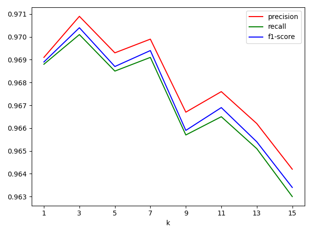
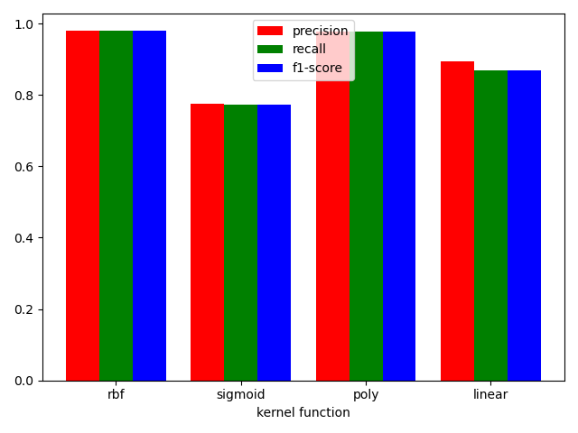
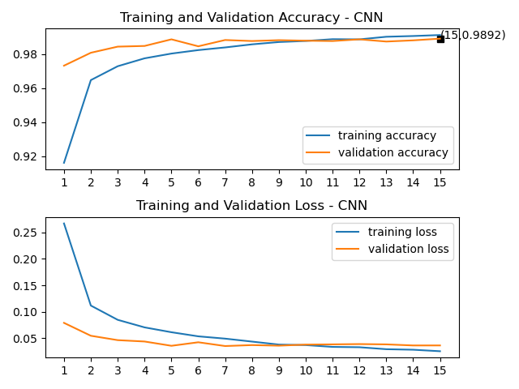
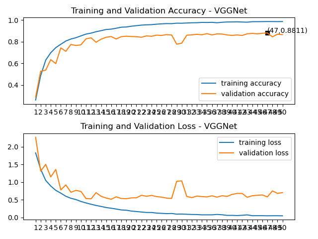
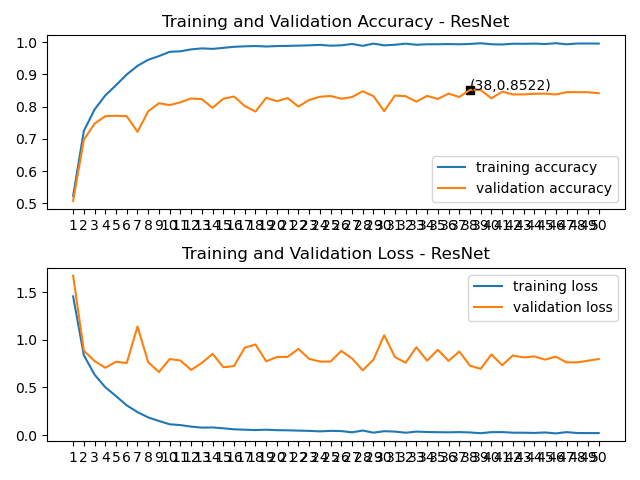

# MNIST-CIFAR10
## 简介
- 使用sklearn库实现KNN和SVM对MNIST数据分类
- 使用TensorFlow实现BP, CNN, LeNet, AlexNet, VGGNet, InceptionNet, ResNet，并对MNIST和CIFAR10数据集进行分类
- 参考了[人工智能实践：TensorFlow笔记-北京大学-曹健](https://www.bilibili.com/video/BV1B7411L7Qt?p=42)的部分代码
## 环境
- 语言：Python 3.7
- 库：TensorFlow 2.1, numpy, matplotlib, sklearn, matplotlib
- IDE：pycharm 2020.1
## 文件清单
- read_data.py：读取MNIST数据集数据，存入numpy数组；两个show打头的函数可以显示读取的数据集图片
- knn.py：使用KNN算法对MNIST数据集进行分类和模型评估，并随机输出25张错误预测样本
- svm.py：使用SVM算法对MNIST数据集进行分类和模型评估
- result.py：对不同参数的模型评估指标进行可视化
- cnn.py：定义了数据与处理函数，可以载入MNIST和CIFAR10两种数据集；定义了acc/loss可视化函数；定义了各种神经网络
- cnn-mnist.py：使用BP网络，自定义单卷积层CNN和LeNet对MNIST数据集进行分类并输出acc/loss可视化图
- cnn-cifar10.py：使用所有定义的神经网络对CIFAR10数据集进行分类并输出acc/loss可视化图
- data：存放mnist数据集的文件夹
## 部分结果展示
- KNN分类结果

- 不同核函数SVM分类结果

- 单层卷积神经网络在MNIST数据集上的分类准确率

- VGGNet在CIFAR10数据集上的分类准确率

- ResNet在CIFAR10数据集上的分类准确率

## 注意事项
- MNIST数据集须自行下载，[官网链接](http://yann.lecun.com/exdb/mnist/)
